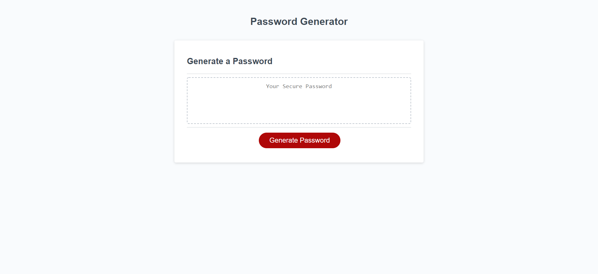

# Password-Generator_Refactor

 My personal objective in regard to this project was to create a simple tool through javascript that generates a strong and unpredictable password based on guidelines set by a user.

I did this by implementing various javascript loops and conditionals and by taking advantage of basic array properties.

The work on this project reinforced some of the basic necessities of javascript, such as backslashing out specific characters so they "remain" in a string, and being careful with your operators when iterating through the length of an array.

 
 

## Click the links below to access the page and repository respectively.
 

 - [Password Generator](https://andis90.github.io/Password-Generator_Refactor/)
 

 - [Password Generator Repository](https://github.com/AndiS90/Password-Generator_Refactor)
 

 

## **Credits**

 

### [License](./assets/License.txt)

 
